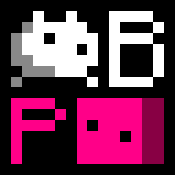

# Baba Make Parabox

**Baba Make Parabox** is a fan-made sokoban-like metagame by **Yangsy56302**.
The original games are [**Baba Is You**](https://hempuli.com/baba/) and [**Patrick's Parabox**](https://www.patricksparabox.com/),
made separately by **Arvi Hempuli** and **Patrick Traynor**.

## How to run

**This Game will run normally only if terminal window exists**
**and no text is selected in terminal window.**
If the game freeze, please confirm you are not
selecting any text in terminal before you report this to me.

Note: batch files in `python` folder only works when python files exists,
and batch files in `windows` folder only works when execution files exists.

If you want to run the source code, download These Things:
- **Python** **_(latest)_**: [Link](https://www.python.org/downloads/)
- **PIP**: Should install with Python
- **Pygame**: Run `pip install -U pygame` in Terminal or something similar to Terminal
- **PyInstaller** **_(optional, if you need exe)_**: Run `pip install -U pyinstaller` in Terminal too

Run `test.bat` to start a official game test.

Run `play.bat` to play a levelpack from json file in the `levelpacks*`* folder.

Run `edit.bat` to edit and save a levelpack from json file in the `levelpacks` folder, or create one.

You can run `help.bat` for more information with how to run the game in terminal.

If you need to make an exe, run `py2exe.bat` in the root folder.

### How to control

- WSAD: You / Cursor move.
- Space: You wait for something / Cursor select a level to play.
- Z: Undo.
- R: Restart the levelpack.
- Tab: Display gamerules.
- Esc：Save level state and go back.
- \- / =: Select world for camera to focus.

### How to win

Please remember:

1. Sometimes the rules itself can be changed;
2. Sometimes some of the rules cannot be changed;
3. Sometimes you need to get inside of a world;
4. Sometimes you need to create a paradox;
5. Sometimes you need to transform the levels and the worlds into each other.

## How to make a custom world

**Important: the levels / worlds / clones that placed are pointed to the levels / worlds / clones that where the camera is.**
If you want to put levels / worlds / clones inside other levels / worlds, please considering cut, copy and paste.

### How to control

- WSAD: Move cursor.
- IKJL: Change orientation.
- Q / E: Select object.
- Tab: Switch object / noun.
- Enter: Place object on cursor (level information from terminal inputs).
- Backspace: Destroy all objects on cursor.
- \- / =: Select world for camera to focus.
- Shift + \- / =: Select level for camera to focus.
- P: New world (information from terminal inputs).
- Shift + P: New level (information from terminal inputs).
- O: Delete current world (confirm in terminal).
- Shift + O: Delete current level (confirm in terminal).
- R: New global rules (information from terminal inputs).
- Shift + R: Delete global rules (information from terminal inputs).
- Z: Undo.
- X: Cut all objects on cursor.
- C: Copy all objects on cursor.
- V: Paste all objects on cursor.
- Close Pygame Window: Save and quit.
- Close Terminal: Do not save, just quit.

## Misc

### Bug List

- `MOVE` overwrite `STOP` when moving.

### About options.json

This game's settings file is named `options.json` in the root directory.
You can try to modify the default settings if you know what `JSON` is.
For example, `fps` means frames per second (theoretically, it is), and `fpw` means frames per wiggle.

## List of Versions

| Number |    Time    | Informations |
|--------|------------|--------------|
| 1.0    | 2024.07.05 | Initialized. |
| 1.1    | 2024.07.06 | Keke is Move; Game is Undo and Restart; Baba make Levels |
| 1.11   | 2024.07.06 | Level is Previous and Next |
| 1.2    | 2024.07.06 | Flag is Win; Game is EXE |
| 1.3    | 2024.07.06 | Baba is Keke; World is Input and Output |
| 1.31   | 2024.07.07 | Terminal is More; Text is not Hide; Level is Red |
| 1.4    | 2024.07.07 | Baba make Worlds |
| 1.41   | 2024.07.07 | Level is Best and Swap |
| 1.42   | 2024.07.08 | Code is Better |
| 1.5    | 2024.07.08 | Baba is Float; Me is Sink; Rock is Defeat |
| 1.6    | 2024.07.08 | Door is Shut; Key is Open |
| 1.7    | 2024.07.09 | All has Color; Lava is Hot; Ice is Melt |
| 1.8    | 2024.07.10 | Game has Icon; Baba is Word; Keke is Shift; Rock is Tele |
| 1.81   | 2024.07.10 | Argv is Better |
| 1.9    | 2024.07.10 | All is Wobble; Code is Better |
| 1.91   | 2024.07.10 | Lava is Orange; Pos is Best |
| 2.0    | 2024.07.11 | Level is not World; Cursor is Select |
| 2.1    | 2024.07.11 | Bug is Fix; World is Level |
| 2.11   | 2024.07.12 | Undo and Restart is Fix |
| 2.12   | 2024.07.12 | Object is More |
| 2.13   | 2024.07.12 | Esc is Out |
| 2.2    | 2024.07.12 | World feeling Push and Options is Better |
| 2.21   | 2024.07.12 | Bug is Fix; Patrick is You |
| 2.22   | 2024.07.12 | Changes is Small |
| 2.3    | 2024.07.13 | Baba is not You; Rule is Recursion |
| 2.31   | 2024.07.14 | Baba is More and You |
| 2.4    | 2024.07.14 | not Baba is You; Level is Baba |
| 2.41   | 2024.07.14 | Bug on World feeling Push is Fix |
| 2.42   | 2024.07.14 | World is You |
| 2.43   | 2024.07.15 | Baba is You and Win |
| 2.5    | 2024.07.15 | Key on Editor is Better; Level has Icon and Color |
| 2.51   | 2024.07.15 | World is Word; Object is More |
| 2.52   | 2024.07.15 | Code feeling Push is Better |

## Bug Reports and Suggestions

Send your message to **yangsy56302@163.com**!

## Support

Not open for now.