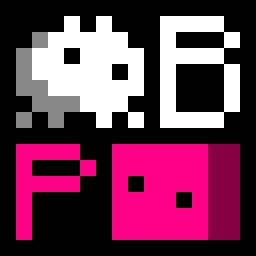

# Baba Make Parabox

**Baba Make Parabox**（简称 **BMP**）是一个二创同人推箱子元游戏，作者是**Yangsy56302**。
取材游戏为[**Baba Is You**](https://hempuli.com/baba/)与[**Patrick's Parabox**](https://www.patricksparabox.com/)，
作者分别为**Arvi Hempuli**和**Patrick Traynor**。

**本游戏的源代码使用[MIT许可证](https://opensource.org/license/MIT/)。**

**本游戏使用[Pygame](https://www.pygame.org/news/)作为游戏引擎，而Pygame使用[GNU宽通用公共许可证 2.1版](https://www.gnu.org/licenses/old-licenses/lgpl-2.1.html)。**
因此，本人不提供任何Pygame源代码，请自行获取。
但本人确实提供使用未经修改的Pygame版本经[PyInstaller](https://pyinstaller.org/en/stable/index.html)打包后形成的游戏程序。
**PyInstaller使用[GNU通用公共许可证 第2版](https://www.gnu.org/licenses/old-licenses/gpl-2.0.html)。**

**我并未拥有游戏纹理的版权。**
如果您有关于游戏纹理的使用权等权利的更多信息，请尽快联系我。
从2024.10.23起，该仓库将不再附带Baba Is You的原创纹理，
尽管您仍然可以从Github等平台的发布页附近下载这些纹理。

该游戏的雏形诞生于2024.05.15，游戏文件夹创建时间为北京时间12:12:15。

## 新手指南

### 下载

请跳转到[Gitlab](https://gitlab.com/Yangsy56302/BabaMakeParabox)，
点击界面右侧的**Release**，展开**Assets**，然后下载以下文件：

+ `baba-is-you-original-sprites.zip`
    + 原版 Baba Is You 的纹理，必备
+ （前略）`assets.zip`
    + Baba Make Parabox 绘制的新纹理，必备
+ （前略）`windows-x64.zip`
    + Baba Make Parabox 的游戏本体，必备 *（除非此处下载的程序无法运行，或者您知道怎么将Python代码转为可执行程序）*
+ （前略）`linux.zip`
    + 源代码，以及在GNU/Linux系统运行游戏需要的部分内容，建议下载 *（当游戏本体无法运行时的备选方案）*
+ `Source code`
    + 包括源代码在内的诸多文件，可选下载

备用下载地址包括连接不稳定的[Github](https://github.com/Yangsy56302/BabaMakeParabox)
以及需要注册账号才能下载的[Gitee](https://gitee.com/Yangsy56302/BabaMakeParabox)，此处不推荐。

### 安装

+ **推荐方式**
    1. 在您准备安装的位置（如`C:\Program Files`）新建一个文件夹；
    2. 将压缩包`baba-is-you-original-sprites.zip`，`assets.zip`，`windows-x64.zip`内的文件解压到该文件夹内。
+ **推荐方式不起作用时的备用方案**
    1. 解压通过点击`Source code`下载的压缩包；
    2. 通过以下任意一种方式安装**Python**：
        + 官方安装方式
            1. 打开[Python](https://www.python.org)官方网站；
            2. 找到位于Logo右下方的**Downloads**，悬停展开；
            3. 在展开后的部分找到**Download for Windows**下方的按钮，点击以下载；
            4. 打开下载完成的安装程序，勾选最下方的**Add python.exe to PATH**，然后点击醒目的**Install Now**以安装Python；
            5. 等待安装完成，然后重启电脑。
        + （待补）
    3. 运行`inst-win.bat`，这一步骤会自行生成`bmp.exe`和`submp.exe`。

### 运行

双击运行`play-win.bat`，这将会间接运行`bmp.exe`，启动游戏程序。
也可以直接运行`bmp.exe`，但程序故障后会直接关闭终端窗口，所以不推荐。

游戏程序第一次运行时可能会让您选择语言。

**游戏仅在终端窗口存在**
**并且未选中窗口内部文本时正常运行。**
如果游戏卡死，请先确保您
没有在终端内选中任何文字，再汇报游戏漏洞。

同时确保您已经准备好了关卡包文件，若没有，可以现场[制作一个](#制作关卡包)。

### 控制

+ WSAD：移动
+ Space：等待
+ Z：撤回
+ R：重新开始关卡
+ Tab：显示游戏规则
+ Esc：返回上一级世界
+ \+ / =：选择摄像机所在的世界
+ F1: 显示FPS
+ 关闭游戏窗口：保存并退出
+ 关闭终端：不保存退出

## 特殊物体

+ **文本** *（TEXT）*：组成自定义游戏规则的物体。
    + 文本物体默认拥有`PUSH`属性。
    + 根据用法的不同，可以进行分类：
        + 名词：指代一类物体。
            + 诸如`BABA`，`FLAG`，`TEXT`等都是名词。
                + 注意区分所有文本和`TEXT`：所有文本都是`TEXT`名词的指代对象。
            + 如果开启元文本选项，则可以出现元文本——指向特定文本的名词，如指向`BABA`的`TEXT_BABA`。
                + 元文本也属于文本，所以可以出现`TEXT_TEXT_TEXT_BABA`这样的多层套娃元文本。
        + 介词：指代操作类型。
            + 截至3.2，只有四种：`IS`，`HAS`，`MAKE`，和`WRITE`。
        + 属性词：指代一类物体属性。
            + 诸如`YOU`，`WIN`，`WORD`等都是属性词。
        + 修饰词：指代限定条件类型。
            + 前缀修饰词：`SELDOM`，`OFTEN`和`META`。
            + 中缀修饰词：`ON`，`NEAR`，`NEXTTO`，`WITHOUT`和`FEELING`。
        + 元文本修饰词`TEXT_`。
            + 尽管`TEXT_`的作用方式类似于前缀修饰词，然而数据层面上`TEXT_`并不属于修饰词。
                + `TEXT_`在源代码内的类名为`TextText_`，其直接继承自`Text`类（文本）而非`Prefix`类（前缀修饰词）。
        + 并列词`AND`。
        + 否定词`NOT`。
    + 初步检测时允许的语法：
        + 并列泛名词 介词 并列泛属性词
            + 并列泛名词 := 并列泛名词 并列词 泛名词 *或者* 泛名词
                + 泛名词 := 并列泛前缀修饰词 泛名词 泛中缀修饰词 *或者* 基础泛名词
                    + 泛中缀修饰词 := 基础泛中缀修饰词 并列泛属性词
                        + 并列泛属性词 := 并列泛属性词 并列词 泛属性词 *或者* 泛属性词
                            + 泛属性词 := 否定词 泛属性词 *或者* 属性词 *或者* 元名词
                                + 元名词 := 元文本修饰词 元名词 *或者* 名词
                        + 基础泛中缀修饰词 := 否定词 基础泛中缀修饰词 *或者* 中缀修饰词
                    + 并列泛前缀修饰词 := 并列泛前缀修饰词 并列词 基础泛前缀修饰词 *或者* 基础泛前缀修饰词
                        + 基础泛前缀修饰词 := 否定词 基础泛前缀修饰词 *或者* 前缀修饰词
                    + 基础泛名词 := 否定词 基础泛名词 *或者* 元名词
    + 若将其他类型的物体转换为文本物体，则该物体会转换为对应的名词物体。
+ **世界** *（WORLD）*：可以指一个容纳物体的长方形空间，也可以指一个间接包含前者的特殊物体。约定称前者为**世界**，称后者为**世界物体**。
    + 世界物体默认拥有`PUSH`属性；世界默认拥有`ENTER`和`LEAVE`属性。
    + 若外世界内有一个内世界物体，则可以尝试通过把具有`PUSH`属性的物体推出边缘而将其从内世界推出到外世界。
        + 若前提不成立，则失败。
        + 若物体被空间物体阻挡，则尝试根据相对位置转移物体。
            + 若物体被阻挡，则失败。
            + 若物体试图推动自己，则失败。
            + 若物体或转移世界的`ENTER`属性被禁用，则失败。
        + 若物体被其他物体阻挡，则失败。
        + 若过程中多次经过同一世界，则：
            1. 在关卡内寻找名称相同，无限等级大一的世界，作为无限大世界。
                + 若世界未找到，则失败。
            2. 在关卡内寻找包含无限大世界物体的世界。
                + 若世界物体未找到，则失败。
            3. 尝试将物体从无限大世界推出。
                + 若物体被阻挡，则失败。
                + 若物体试图推动自己，则失败。
                + 若物体或无限大世界的`LEAVE`属性被禁用，则失败。
        + 若物体或世界的`LEAVE`属性被禁用，则失败。
    + 若外世界内有一个内空间物体受到推力，则其优先按顺序选择以下一项：
        1. 尝试通过推动前面的物体从而允许自身被推动。
            + 若前方物体无法被推动，则失败。
        2. 将在推力方向距离内空间物体最近的具有`PUSH`属性但无法被推动的物体从外世界挤入到内世界。
            + 若物体被阻挡，则失败。
            + 若物体试图推动自己，则失败。
            + 若物体或世界的`ENTER`属性被禁用，则失败。
        3. 将对内空间物体施加推力的物体从外世界推入到内世界。
            + 若物体被阻挡，则失败。
            + 若物体试图推动自己，则失败。
            + 若过程中多次经过同一世界，则：
                1. 在关卡内寻找名称相同，无限等级小一的世界，作为无限小世界。
                    + 若世界未找到，则失败。
                2. 尝试将物体推入无限小世界。
                    + 若物体试图推动自己，则失败。
                    + 若物体或无限小世界的`ENTER`属性被禁用，则失败。
            + 若物体或世界的`ENTER`属性被禁用，则失败。
        4. 拒绝移动。
    + 可以有多个指向同一个世界的世界物体。
        + 尽管 Patrick's Parabox 里的盒子只能有一个对应的本体，但本游戏抛弃了该设定。
        + 当物体从被多个世界物体对应的世界推出时，所有世界物体都会创建一个该物体的副本。
            + 此机制可以用来快捷地复制物体。
    + 关于规则：
        + 部分属性词会同时作用在整个世界范围内。
        + 关于转换：
            + 若将世界物体转换为其他类型的物体，则：
                + 克隆物体：转换为指向相同世界的克隆物体。
                + 关卡物体：转换为以指向的世界为主世界，包含所在关卡内所有世界的关卡物体。
                + 其他物体：转换为该物体，保留世界相关信息。
            + 若将其他类型的物体转换为世界物体，则：
                + 克隆物体：转换为指向相同世界的世界物体。
                + 关卡物体：转换为以主世界为所指向的世界，包含该关卡内所有世界的世界物体。
                + 其他物体：
                    1. 转换为以该物体可能包含的世界相关信息为所指向的世界的世界物体。
                    2. 若无相关信息，则转换为包含该物体的 3 \* 3 世界。
+ **克隆** *（CLONE）*：类似于世界物体，但有些许不同。约定称为**克隆物体**。世界物体和克隆物体统称为**空间物体**。
    + 将物体从世界内推出时忽略克隆物体。
    + 其他特性与关卡物体一致。
+ **关卡** *（LEVEL）*：可以指包含多个世界的存在，也可以指被包含在世界内的指向前者的特殊物体。约定称前者为**关卡**，称后者为**关卡物体**。
    + 关卡物体默认包含属性`STOP`。
    + 关于规则：
        + 部分属性词会同时作用在整个关卡范围内。
        + 关于转换：
            + 除了上述情况外，若将关卡物体转换为其他类型的物体，则转换为该物体，保留关卡相关信息。
            + 除了上述情况外，若将其他类型的物体转换为关卡物体，则：
                1. 转换为以该物体可能包含的关卡相关信息为所指向的关卡的关卡物体。
                2. 若无相关信息，则转换为包含将该物体转换为世界时产生的世界的关卡。
+ **游戏** *（GAME）*：指代游戏本身。
    + 关于规则：
        + 可以使用大部分属性词，且部分有独特的效果。
        + 无法附加修饰词。
        + 关于转换：
            + 若将游戏物体转换为其他类型的物体，则将该物体贴图覆盖游戏界面。
            + 若将其他类型的物体转换为游戏物体，则删除该物体，同时新建子进程显示该物体的默认贴图。

## 关卡包编辑器

该章节暂时不提供有关游戏设计的相关信息。

### 控制

+ WSAD：移动光标
+ Shift + WSAD：选择物体朝向
+ Q / E：选择物体
+ Tab：根据物体选择对应名词
+ Shift + Tab：根据名词选择对应物体
+ 0 ~ 9：从调色板选择物体
+ Ctrl + 0 ~ Ctrl + 9：设置调色板的物体为当前选择的物体
+ Enter：在光标上放置物体
+ Shift + Enter：在光标上放置物体 \*
+ Ctrl + Enter：强制在光标上放置物体
+ Ctrl + Shift + Enter：强制在光标上放置物体 \*
+ Backspace：删除光标上的物体
+ \+ / =：选择摄像机所在的世界
+ Shift + \+ / =：选择摄像机所在的关卡
+ \\：新世界 \*
+ Shift + \\：新关卡 \*
+ Delete：删除世界 \*
+ Shift + Delete：删除关卡 \*
+ R：新建全局规则 \*
+ Shift + R：删除全局规则 \*
+ T：重命名当前世界 \*
+ Shift + T：重命名当前关卡 \*
+ Z：撤回
+ X：剪切光标上的物体至剪切板
+ C：复制光标上的物体至剪切板
+ V：从剪切板粘贴物体到光标上
+ F1: 显示FPS
+ 关闭游戏窗口：保存并退出
+ 关闭终端：不保存退出

**注意：带有 \* 的键位提示代表**
**按下该键之后需要在终端内输入更多信息。**
这段时间内，游戏窗口会被冻结，因为程序正在等待您的输入。

**注意：放置的世界、克隆和关卡**
**默认指向摄像头所在的世界和关卡。**
若有将某个世界、克隆或关卡放在其他世界或关卡内的需要，
请考虑按住Shift键放置，或者进行剪切、复制和粘贴。

## 杂项

### 异常情况分类

#### 游戏特性

+ 相对宽松的`NOT`变体：`NEG`。
    + 属性前带有多个`NEG`的规则只会否定一条恰好缺少一个`NEG`的规则。
        + 例如，`BABA IS NEG YOU`否定一条`BABA IS YOU`；`BABA IS NEG NEG YOU`否定一条`BABA IS NEG YOU`，可能导致已有的`BABA IS YOU`不再被那条`BABA IS NEG YOU`否定。
+ `FEELING`每轮只检测一次，以试图避免检测停机问题。
+ `TEXT IS WORD`有效，导致非元文本被识别为`TEXT`。
    + 通常，这会导致该规则同时被识别成`TEXT IS TEXT`。

#### 暂未实现

+ 属性堆叠。
+ `GAME`的复杂语法（目前对`GAME`应用修饰词会使其不指代任何物体）。
+ 关卡完成情况的记录，特殊物体`PATH`，与之相对应的`CURSOR`移动机制。

#### 游戏漏洞

+ 由于递归移动系统完成度不高导致`MOVE`出现的诸多问题。

### 关于 options.json

位于游戏根目录下的`options.json`是本游戏的设置文件。
如果您知道什么是`JSON`，您可以试着更改里面的默认设置。
例如，`fps`理论上代表游戏帧率，而`fpw`代表贴图抖动帧数。

## 版本列表（版本详细信息暂不翻译）

| 版本号 |    时间    | 版本详细信息 |
|--------|------------|--------------|
| 1.0    | 2024.07.05 | Game is Init |
| 1.1    | 2024.07.06 | Keke is Move; Game is Undo and Restart; Baba make Levels |
| 1.11   | 2024.07.06 | Level is Previous and Next |
| 1.2    | 2024.07.06 | Flag is Win; Game is EXE |
| 1.3    | 2024.07.06 | Baba is Keke; World is Input and Output |
| 1.31   | 2024.07.07 | Terminal is More; Text is not Hide; Level is Red |
| 1.4    | 2024.07.07 | Baba make Worlds |
| 1.41   | 2024.07.07 | Level is Best and Swap |
| 1.42   | 2024.07.08 | Code is Better |
| 1.5    | 2024.07.08 | Baba is Float; Me is Sink; Rock is Defeat |
| 1.6    | 2024.07.08 | Door is Shut; Key is Open |
| 1.7    | 2024.07.09 | All has Color; Lava is Hot; Ice is Melt |
| 1.8    | 2024.07.10 | Game has Icon; Baba is Word; Keke is Shift; Rock is Tele |
| 1.81   | 2024.07.10 | Argv is Better |
| 1.9    | 2024.07.10 | All is Wobble; Code is Better |
| 1.91   | 2024.07.10 | Lava is Orange; Pos is Best |
| 2.0    | 2024.07.11 | Level is not World; Cursor is Select |
| 2.1    | 2024.07.11 | Bug is Fix; World is Level |
| 2.11   | 2024.07.12 | Undo and Restart is Fix |
| 2.12   | 2024.07.12 | Object is More |
| 2.13   | 2024.07.12 | Esc is Out |
| 2.2    | 2024.07.12 | World feeling Push and Options is Better |
| 2.21   | 2024.07.12 | Bug is Fix; Patrick is You |
| 2.22   | 2024.07.12 | Changes is Small |
| 2.3    | 2024.07.13 | Baba is not You; Rule is Recursion |
| 2.31   | 2024.07.14 | Baba is More and You |
| 2.4    | 2024.07.14 | not Baba is You; Level is Baba |
| 2.41   | 2024.07.14 | Bug on World feeling Push is Fix |
| 2.42   | 2024.07.14 | World is You |
| 2.43   | 2024.07.15 | Baba is You and Win |
| 2.5    | 2024.07.15 | Key on Editor is Better; Level has Icon and Color |
| 2.51   | 2024.07.15 | World is Word; Object is More |
| 2.52   | 2024.07.15 | Code feeling Push is Better |
| 2.6    | 2024.07.16 | Key on Editor is Better and Better |
| 2.61   | 2024.07.16 | Editor has Palette |
| 2.7    | 2024.07.16 | Game has Language |
| 2.71   | 2024.07.16 | Language on File is Read |
| 2.8    | 2024.07.16 | Baba and Keke and Me is Baba and You and Win |
| 2.81   | 2024.07.17 | Bug is Fix |
| 2.82   | 2024.07.18 | Color is Number |
| 2.9    | 2024.07.18 | Flag is End; Window is Scale; Game has Sound; FPS is not Hide |
| 2.91   | 2024.07.18 | All is You |
| 3.0    | 2024.07.19 | Game is You |
| 3.001  | 2024.07.19 | Game feeling not Sink and not Float is not Move; Game has Midi |
| 3.002  | 2024.07.19 | All feeling Move is not Slow |
| 3.003  | 2024.07.19 | Bug on Copy and Paste is Fix |
| 3.01   | 2024.07.20 | Text is Word |
| 3.011  | 2024.07.20 | Rule is Atom |
| 3.012  | 2024.07.20 | Game feeling Stop is not Wiggle |
| 3.02   | 2024.07.20 | not Baba is not You |
| 3.1    | 2024.07.21 | Flag on Rock is Win |
| 3.11   | 2024.07.21 | Rock feeling Push is not Push |
| 3.111  | 2024.07.21 | Bug on Game feeling Object is Fix |
| 3.112  | 2024.07.22 | Bug on All feeling Shut and Open is Fix |
| 3.12   | 2024.07.22 | Width is not Height |
| 3.121  | 2024.07.22 | Bug on Flag feeling Win is Fix |
| 3.13   | 2024.07.23 | World is Sink; Text is Float |
| 3.131  | 2024.07.23 | Change is Small |
| 3.132  | 2024.07.23 | Game has Music |
| 3.14   | 2024.07.23 | not meta World is Push |
| 3.141  | 2024.07.23 | meta Level is World |
| 3.142  | 2024.07.24 | Bug on Infix is Fix |
| 3.15   | 2024.07.24 | Baba near Keke is Me |
| 3.151  | 2024.07.24 | Bug feeling Shut and Open is Fix |
| 3.16   | 2024.07.24 | Control is not Continue |
| 3.161  | 2024.07.25 | Game on Linux is Open |
| 3.162  | 2024.07.25 | Bug on Text is Fix |
| 3.2    | 2024.07.26 | Baba make Patrick and has Box and write Win |
| 3.201  | 2024.07.26 | Code is Better; Fps is Switch |
| 3.202  | 2024.07.27 | Options is Better and has Versions |
| 3.21   | 2024.07.31 | Levelpack has Versions; Name is Vanilla |
| 3.211  | 2024.08.01 | Code feeling Strict is More |
| 3.3    | 2024.08.01 | Text_Baba is You |
| 3.31   | 2024.08.01 | Text_ Baba is Text_ Text_ Baba |
| 3.311  | 2024.08.02 | Baba write Text_ You |
| 3.32   | 2024.08.02 | Text on Box is TextPlus; Bug on Text_ on is Fix |
| 3.321  | 2024.08.07 | Number on Text_Text feeling Edit is not Hide |
| 3.4    | 2024.08.07 | Storage on Level and World is Update |
| 3.401  | 2024.08.07 | Game feeling Done is Shut; Text_Text_ is More |
| 3.41   | 2024.08.09 | Level is Map; Levelpack is not Restart |
| 3.5    | 2024.08.24 | Rock is Push and not Enter and not Leave |
| 3.6    | 2024.09.11 | Levelpack eat Logic |
| 3.61   | 2024.09.12 | World is More |
| 3.611  | 2024.09.13 | Bug on World feeling Push is Fix |
| 3.62   | 2024.10.21 | Flag on Baba and Baba and on Keke and on Keke is Win |
| 3.621  | 2024.10.22 | seldom and often Wall without Baba is not Push; Game feeling not Safe is not Done |
| 3.622  | 2024.10.23 | Code has not Asset; Code on Property is Change |
| 3.623  | 2024.11.26 | File is Rename |
| 3.63   | 2024.11.27 | Baba feeling You and not not not You is You; Keke not feeling Move and feeling not not Move is not Move |