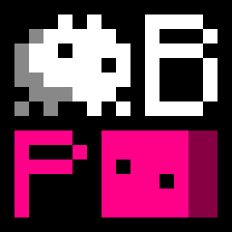

# Baba Make Parabox

**SOME OF THE INFORMATION INCLUDED IN THIS FILE IS OUTDATED.**

**Baba Make Parabox**, or **BMP** in short, is a fan-made sokoban-like metagame by **Yangsy56302**.
The original games are [**Baba Is You**](https://hempuli.com/baba/) and [**Patrick's Parabox**](https://www.patricksparabox.com/),
made separately by **Arvi Hempuli** and **Patrick Traynor**.

**This game used [The MIT License](https://opensource.org/license/MIT/).**

**This game used [Pygame](https://www.pygame.org/news/) for game engine, and Pygame used [GNU Lesser General Public License, version 2.1](https://www.gnu.org/licenses/old-licenses/lgpl-2.1.html)。**
Therefore, I'm not providing any source code of Pygame, please get it by yourself.
But I do provide the game program, build by [PyInstaller](https://pyinstaller.org/en/stable/index.html), using unmodified Pygame souce code.
**PyInstaller used [GNU General Public License, version 2](https://www.gnu.org/licenses/old-licenses/gpl-2.0.html)。**

**I DO NOT have the copyright of the game's sprites.**
If you have some informations about the right of use for the game's sprites or something, please tell me.
This repository won't contain the original sprites of Baba Is You since 2024.10.23,
Although you can still get them on the Release page of Github or somewhere.

The game's prototype was born at 2024.05.15, game's folder at UTC+0 04:12:15 (or UTC+8 12:12:15 in my time zone).

## Download

For [Github](https://github.com/Yangsy56302/BabaMakeParabox),
Click **Releases** on the right side just below About, expand **Assets**, then click on these files you should download.

For [Gitlab](https://gitlab.com/Yangsy56302/BabaMakeParabox),
It should be similar to the steps for Github above to download this game.

For [Gitee](https://gitee.com/Yangsy56302/BabaMakeParabox),
or if you are from China, [Click me for more info](readme_cn.md#下载).

## Run

**This Game will run normally only if terminal window exists**
**and no text is selected in terminal window.**
If the game freeze, please confirm you are not
selecting any text in terminal before you report this as an bug.

Start `bmp.exe` or `bmp.sh` depends on your current operating system,
then follow the terminal messages to start the game.
Please make sure you have a levelpack file, if not, you can [make one](#how-to-make-a-custom-levelpack).

For Windows users, if you need to make an exe for yourself, run `inst-win.bat`.
For GNU/Linux users, run `inst-arch.sh` or `inst-ubuntu.sh` first.

### Control

+ WSAD: You / Cursor move.
+ Space: You wait for something / Cursor select a level to play.
+ Z: Undo.
+ R: Restart the level.
+ Tab: Display gamerules.
+ Esc：Go back to the superlevel.
+ \- / =: Select world for camera to focus.
+ F1: Show FPS.
+ Close Pygame Window: Save and quit.
+ Close Terminal: Do not save, just quit.

### How to Win

Please remember:

1. Sometimes the rules itself can be changed;
2. Sometimes some of the rules cannot be changed;
3. Sometimes you need to get inside of a world;
4. Sometimes you need to create a paradox;
5. Sometimes you need to transform the levels and the worlds into each other.

### About Special Nouns / Objects

Please help me to translate this chapter from [the Chinese version of readme file](readme_cn.md)...

## How to Make a Custom Levelpack

This chapter is not a game design hint.

### Control

+ WSAD: Move cursor.
+ Shift + WSAD: Change orientation.
+ Q / E: Select object.
+ Tab: Select noun from object.
+ Shift + Tab: Select object from noun.
+ 0 ~ 9: Select object from palette.
+ Ctrl + 0 ~ Ctrl + 9: Set palette from selected object.
+ Enter: Place object on cursor.
+ Shift + Enter: Place object on cursor. \*
+ Ctrl + Enter: Force to place object on cursor.
+ Ctrl + Shift + Enter: Force to place object on cursor. \*
+ Backspace: Destroy all objects on cursor.
+ \- / =: Select world for camera to focus.
+ Shift + \- / Shift + =: Select level for camera to focus.
+ \\: New world. \*
+ Shift + \\: New level. \*
+ Delete: Delete current world. \*
+ Shift + Delete: Delete current level. \*
+ R: New global rules. \*
+ Shift + R: Delete global rules. \*
+ T: Rename Current World. \*
+ Shift + T: Rename Current Level. \*
+ Z: Undo.
+ X: Cut all objects on cursor.
+ C: Copy all objects on cursor.
+ V: Paste all objects on cursor.
+ F1: Show FPS.
+ Close Pygame Window: Save and quit.
+ Close Terminal: Do not save, just quit.

**Important: Key descriptions with \* means you need to**
**input some informations on terminal after pressing this key.**
During that time, the game window will freeze because the program is waiting for inputs.

**Important: as default, the level / world / clone objects that placed**
**are pointed to the levels / worlds that where the camera is.**
If you want to put level / world / clone objects inside other levels / worlds,
please considering shift + enter, or cut, copy, and paste.

## Misc

### Feature List

+ less strictly varient of `NOT`: `NEG`.
    + `NEG`s before a property-like text only negates exactly 1 rule that has exactly 1 less `NEG` on the exactly same property, and nothing else.
    + `NEG`s in other positions still acts same as the `NOT`s by now.
    + Like, `BABA IS NEG NEG NEG YOU` only disables 1 `BABA IS NEG NEG YOU` rule if exist, and won't do anything with `BABA IS YOU`.
    + `BABA IS NEG NEG YOU` won't make Baba `YOU` either: it disables a `BABA IS NEG YOU` rule.
        + Although, if there is also a `BABA IS YOU` rule, the rule with 2 `NEG`s will disable the rule with 1 `NEG`s, causes `BABA IS YOU` enabled again.
+ `FEELING` only try once per round for avoiding halting problem.
+ `TEXT IS WORD` will make every text that isn't a metatext also acts like `TEXT`.
    + This will usually cause the rule right above can also be identified as `TEXT IS TEXT`.

### Not Implemented Yet

+ Stacking property.
+ Complex grammar about `GAME`.

### Bug List

+ A lot of `MOVE` problems because recursive movement system incomplete.

### About options.json

This game's settings file is named `options.json` in the root directory.
You can try to modify the default settings if you know what `JSON` is.
For example, `fps` means frames per second (theoretically, it is), and `fpw` means frames per wiggle.

## List of Versions

| Number |    Time    | Informations |
|--------|------------|--------------|
| 1.0    | 2024.07.05 | Game is Init |
| 1.1    | 2024.07.06 | Keke is Move; Game is Undo and Restart; Baba make Levels |
| 1.11   | 2024.07.06 | Level is Previous and Next |
| 1.2    | 2024.07.06 | Flag is Win; Game is EXE |
| 1.3    | 2024.07.06 | Baba is Keke; World is Input and Output |
| 1.31   | 2024.07.07 | Terminal is More; Text is not Hide; Level is Red |
| 1.4    | 2024.07.07 | Baba make Worlds |
| 1.41   | 2024.07.07 | Level is Best and Swap |
| 1.42   | 2024.07.08 | Code is Better |
| 1.5    | 2024.07.08 | Baba is Float; Me is Sink; Rock is Defeat |
| 1.6    | 2024.07.08 | Door is Shut; Key is Open |
| 1.7    | 2024.07.09 | All has Color; Lava is Hot; Ice is Melt |
| 1.8    | 2024.07.10 | Game has Icon; Baba is Word; Keke is Shift; Rock is Tele |
| 1.81   | 2024.07.10 | Argv is Better |
| 1.9    | 2024.07.10 | All is Wobble; Code is Better |
| 1.91   | 2024.07.10 | Lava is Orange; Pos is Best |
| 2.0    | 2024.07.11 | Level is not World; Cursor is Select |
| 2.1    | 2024.07.11 | Bug is Fix; World is Level |
| 2.11   | 2024.07.12 | Undo and Restart is Fix |
| 2.12   | 2024.07.12 | Object is More |
| 2.13   | 2024.07.12 | Esc is Out |
| 2.2    | 2024.07.12 | World feeling Push and Options is Better |
| 2.21   | 2024.07.12 | Bug is Fix; Patrick is You |
| 2.22   | 2024.07.12 | Change is Small |
| 2.3    | 2024.07.13 | Baba is not You; Rule is Recursion |
| 2.31   | 2024.07.14 | Baba is More and You |
| 2.4    | 2024.07.14 | not Baba is You; Level is Baba |
| 2.41   | 2024.07.14 | Bug on World feeling Push is Fix |
| 2.42   | 2024.07.14 | World is You |
| 2.43   | 2024.07.15 | Baba is You and Win |
| 2.5    | 2024.07.15 | Key on Editor is Better; Level has Icon and Color |
| 2.51   | 2024.07.15 | World is Word; Object is More |
| 2.52   | 2024.07.15 | Code feeling Push is Better |
| 2.6    | 2024.07.16 | Key on Editor is Better and Better |
| 2.61   | 2024.07.16 | Editor has Palette |
| 2.7    | 2024.07.16 | Game has Language |
| 2.71   | 2024.07.16 | Language on File is Read |
| 2.8    | 2024.07.16 | Baba and Keke and Me is Baba and You and Win |
| 2.81   | 2024.07.17 | Bug is Fix |
| 2.82   | 2024.07.18 | Color is Number |
| 2.9    | 2024.07.18 | Flag is End; Window is Scale; Game has Sound; FPS is not Hide |
| 2.91   | 2024.07.18 | All is You |
| 3.0    | 2024.07.19 | Game is You |
| 3.001  | 2024.07.19 | Game feeling not Sink and not Float is not Move; Game has Midi |
| 3.002  | 2024.07.19 | All feeling Move is not Slow |
| 3.003  | 2024.07.19 | Bug on Copy and Paste is Fix |
| 3.01   | 2024.07.20 | Text is Word |
| 3.011  | 2024.07.20 | Rule is Atom |
| 3.012  | 2024.07.20 | Game feeling Stop is not Wiggle |
| 3.02   | 2024.07.20 | not Baba is not You |
| 3.1    | 2024.07.21 | Flag on Rock is Win |
| 3.11   | 2024.07.21 | Rock feeling Push is not Push |
| 3.111  | 2024.07.21 | Bug on Game feeling Object is Fix |
| 3.112  | 2024.07.22 | Bug on All feeling Shut and Open is Fix |
| 3.12   | 2024.07.22 | Width is not Height |
| 3.121  | 2024.07.22 | Bug on Flag feeling Win is Fix |
| 3.13   | 2024.07.23 | World is Sink; Text is Float |
| 3.131  | 2024.07.23 | Change is Small |
| 3.132  | 2024.07.23 | Game has Music |
| 3.14   | 2024.07.23 | not meta World is Push |
| 3.141  | 2024.07.23 | meta Level is World |
| 3.142  | 2024.07.24 | Bug on Infix is Fix |
| 3.15   | 2024.07.24 | Baba near Keke is Me |
| 3.151  | 2024.07.24 | Bug feeling Shut and Open is Fix |
| 3.16   | 2024.07.24 | Control is not Continue |
| 3.161  | 2024.07.25 | Game on Linux is Open |
| 3.162  | 2024.07.25 | Bug on Text is Fix |
| 3.2    | 2024.07.26 | Baba make Patrick and has Box and write Win |
| 3.201  | 2024.07.26 | Code is Better; Fps is Switch |
| 3.202  | 2024.07.27 | Options is Better and has Versions |
| 3.21   | 2024.07.31 | Levelpack has Versions; Name is Vanilla |
| 3.211  | 2024.08.01 | Code feeling Strict is More |
| 3.3    | 2024.08.01 | Text_Baba is You |
| 3.31   | 2024.08.01 | Text_ Baba is Text_ Text_ Baba |
| 3.311  | 2024.08.02 | Baba write Text_ You |
| 3.32   | 2024.08.02 | Text on Box is TextPlus; Bug on Text_ on is Fix |
| 3.321  | 2024.08.07 | Number on Text_Text feeling Edit is not Hide |
| 3.4    | 2024.08.07 | Storage on Level and World is Update |
| 3.401  | 2024.08.07 | Game feeling Done is Shut; Text_Text_ is More |
| 3.41   | 2024.08.09 | Level is Map; Levelpack is not Restart |
| 3.5    | 2024.08.24 | Rock is Push and not Enter and not Leave |
| 3.6    | 2024.09.11 | Levelpack eat Logic |
| 3.61   | 2024.09.12 | World is More |
| 3.611  | 2024.09.13 | Bug on World feeling Push is Fix |
| 3.62   | 2024.10.21 | Flag on Baba and Baba and on Keke and on Keke is Win |
| 3.621  | 2024.10.22 | Game feeling not Safe is not Done |
| 3.622  | 2024.10.23 | Code has not Asset; Code on Property is Change |
| 3.623  | 2024.11.26 | File is Rename |
| 3.63   | 2024.11.27 | Baba feeling You and not not not You is You; Keke not feeling Move and feeling not not Move is not Move |